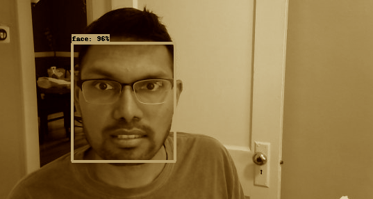

## <I>Answers to questions from HW #7 </I>

##### Describe your solution in detail. What neural network did you use? What dataset was it trained on? What accuracy does it achieve?

Objective of this assignment was to repurpose the flow from homework 3 (which implemented a soup-to-nuts MQTT sender/receiver, Jetson facial recognition Python and a subsequent broker/receiver set up on the IBM cloud - more info here <U> https://github.com/MIDS-scaling-up/v2/tree/master/week03/hw </U>)

Keeping the latter part of the process flow intact (sending images to IBM cloud and saving on S3 buckets), I reprogrammed logic to capture images on Jetson and to implement facial recognition as required in this assignment.

For this, I took the bulk of facial recognition logic, along with the saved Tensorflow model from the given link <U> https://github.com/yeephycho/tensorflow-face-detection </U> (In short, neural network used here is A mobilenet SSD (single shot multibox detector) based face detector with pretrained model provided by Tensorflow object detection API, trained on WIDERFACE dataset).

Lastly, I tweaked the `Dockerfile` used in homework #3 to change the CUDA base image to a Tensorflow image -- everything else being almost same as the earlier Dockerfile.

##### Does it achieve reasonable accuracy in your empirical tests? Would you use this solution to develop a robust, production-grade system?

Accuracy hovers between 70-99% depending on the orientation of face and light conditions. Here is a sample file : <U> https://vebsbuck.s3.us-east.cloud-object-storage.appdomain.cloud/2020-05-16_2.png </U>

Sample image:

As such, I would definitely use this solution to develop a production-grade system. Perhaps, more testing needs to be done on a wider audience and with more objects to evaluate the effectiveness of the model.

#####  What framerate does this method achieve on the Jetson? Where is the
bottleneck?

While not accurately able to tell the frame-rate, from my prior experience with OpenCV running on Jetson -- this model does seem to perform much better and seamlessly detect faces than the OpenCV model. As such, I would say the model achieved upwards of 10fps.

The only bottleneck seemed to be with the titling and "albumentations" (i.e. shifting/scaling/rotating/cutting of facial images). In such cases, the model was not able to detect faces; or the accuracy dropped from the mid-90s to low 70s.

##### Which is a better quality detector: the OpenCV or yours?
It's really tough to tell which of the models is the better one. From my point of view, OpenCV/haarcascade_frontalface_default model is simpler, easier to use and lightweight. It also seems to detect cropped faces.

However, one of the benefits of the current Tensorflow object detection API based mobilenet SSD model is that it can be used on a variety of objects, and not just faces. Additionally, while bulky, it is not terribly oversized (at just 22MB in disk size) - while giving a much better quality resolution and FPS.

---------
#### IMPLEMENTATION QUIRKS AND TIME CONSUMING ITEMs
- One thing to note was that I was initially working from my Macbook and SSH'd into Jetson. While doing so, I did not realize that the X Widnow system does not work seamlessly, even after I ran `xhost local:root`.
  So I eventually logged into Jetson directly and ran all the pipelines in the system directly.
- I ran following command to let OpenCV accept my external Logitech webcam `export $DISPLAY=0.0`
