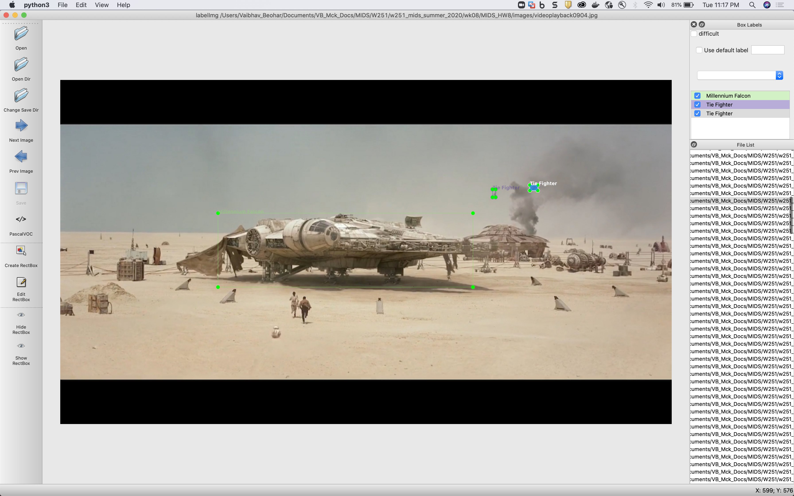
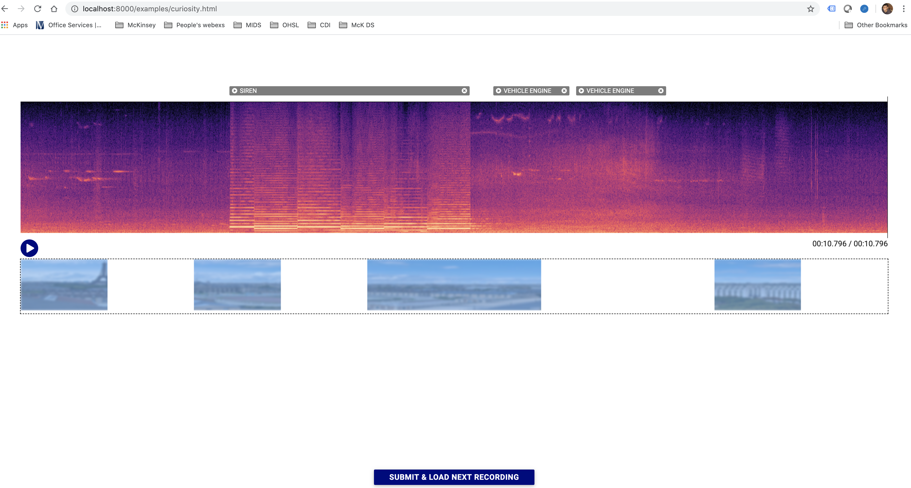
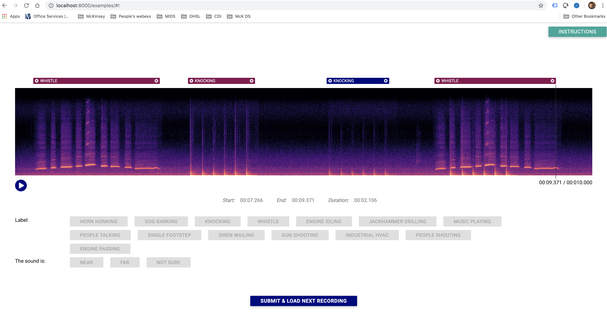

# HW 8: Annotations!

Vaibhav Beohar - MIDS / W251 / Summer 2020

## 1. Annotating dataset of images manually

This homework required manually tagging images of Millennium Falcon and Tie fighters using the labelImg tool at <U>https://github.com/tzutalin/labelImg</U>. Image dataset could be found by cloning repo <U>https://github.com/rdejana/MIDS_HW8</U>.

Here is an example of a manual tagging:

Tagged lables can be found in the `image_annotations.zip` in this repo.

- I spent almost 2 hours and 45 min tagging all 384 images
- Total of 294 Tie fighters were tagged; and 309 Millennium Falcon images were tagged. You can do a simple `grep "" | wc` to find the wordcounts in the xml files corresponding to the tags
- Large datasets should be handled intelligently by outsourcing work to specially trained staff who are adept in handling such software. I am sure there are better and software tools that can minimize effort. In addition, there must be AI tools that can do tagging of simple images.
- In my opinion augmentations can alter the annotations because of the orientation shifts. Therefore, special care should be taken to ensure that various images of the same object are annotated from various angles/orientations to minimize error in modeling.

## 2. Image Augmentation
The image augmentation was done using a pre-created docker repo at `docker run -d -p 8888:8888 ryandejana/hw8augmentation`. The tool used is located at <U>https://github.com/codebox/image_augmentor</U>. Final submissions can checked using `augmentation.ipynb`.

Describe the following augmentations in your own words
- Flip: Horizontally mirrors image around a vertical line running from center; vertically mirrors image around a horizontal line running through its center
- Rotation: Rotates the image by an angle of rotation specified by a integer value that is included in the argument that could be a positive or negative number.
- Scale: Increase or decrease image image size, or zoom in or out
- Crop: Just keep some particular image section and remove rest
- Translation: Move the image in some direction. The size of the translation in the x and y directions are specified by integer values that are included in the argument
- Noise: Adds random noise to the image specified by a floating-point numeric value.

## 3. Sound Augmentation
Take a look at and explore the audio annotation tool CrowdCurio <U>https://github.com/CrowdCurio/audio-annotator</U>). Keep in mind that the `SimpleHTTPServer` mentioned in the CrowdCurio tool only works for Python2. I used `$python3 -m http.server 8000` to launch the HTTP webservice instead <I>(more info at <U>https://www.journaldev.com/15915/python-simplehttpserver-http-server</U>)</I>

- Audio annotations require us to listen to the audio and use a real-world judgement of what the sound could be. The determination and tagging experience is enhanced by tools that can visualize sound wave-forms, so users can discern various events. Additionally, audio augmentation can involve the need to differentiate between near/far and very far sounds.

Here are some examples of annotations done using CrowdCurio:

