### Homework 9: Distributed Training and Neural Machine Translation
#### Vaibhav K Beohar - June 2020

Salient features of this assignment:
- Used Nvidia OpenSeq2Seq (framework for sequence to sequence tasks such as Automatic Speech Recognition (ASR) and Natural Language Processing (NLP), written in Python and TensorFlow)
-Many of these tasks take a very long to train, hence the need to train on more than one machine
-This assignment trains a Transformer-based Machine Translation network on a small English to German WMT corpus
-This assigment aimed at training the model across two identical machines (ideally v100s). But because of non-availability of v100s in IBM datacenters, we settled for one p100 and one v100
-Uses Uber Horovod to train models across distributed machines and utilizes MPI as means to communicate across machine GPUs
-More information about the assignment here <U>https://github.com/MIDS-scaling-up/v2/tree/master/week09/hw</U>

### Questions

* How long does it take to complete the training run? (hint: this session is on distributed training, so it will take a while)
    * The entire training for approximately 50000 steps (as indicated in the assignment instructions) took about 26 hours in all.

  

    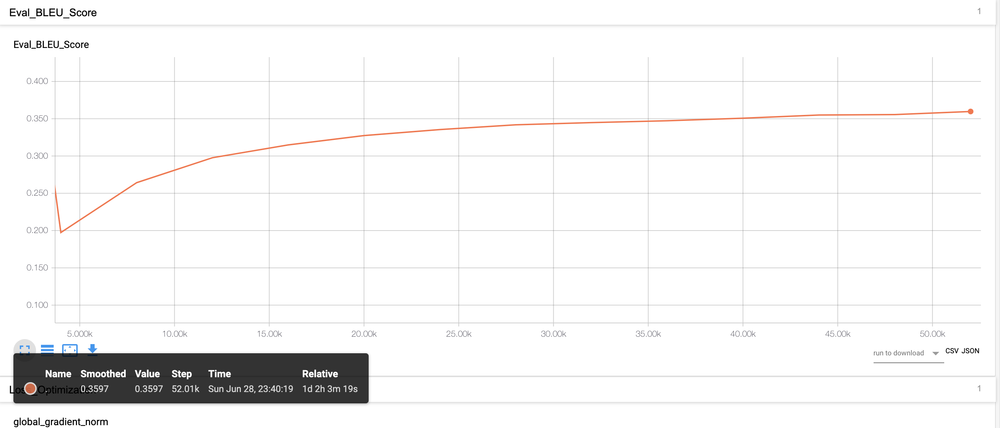
    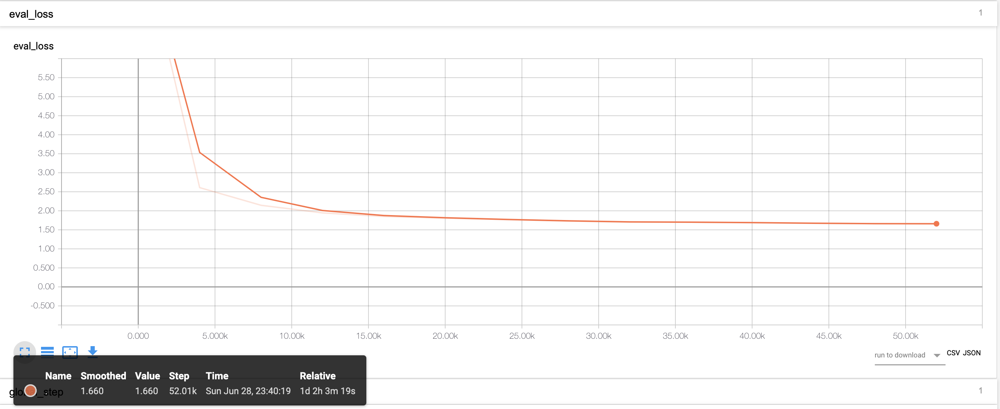
    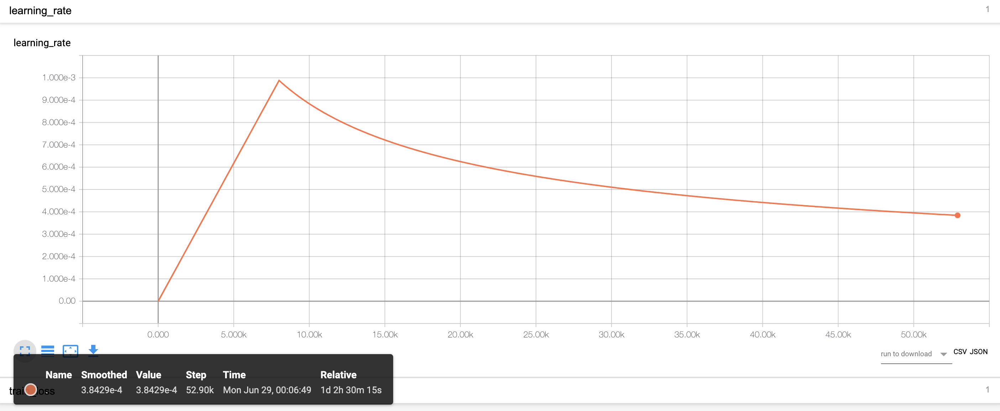
    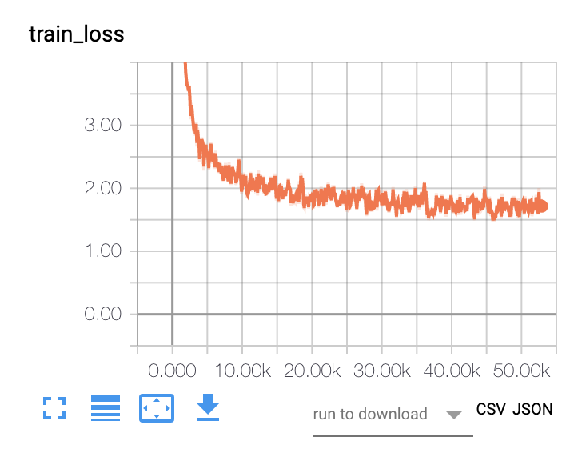
  

* Do you think your model is fully trained? How can you tell?
Were you overfitting?
    * The model is very close to being fully trained - because the BLUE score was almost static and hovering ~0.359 as you can tell from the below screenshot after 50k steps in the training. It did not significantly improve after 40k steps of training (but there is still little bit of potential the model could have improved, had we let it run for another 50k steps). Additionally, the training eval_loss is also at 1.6 -- very close to what was indicated in the Homework assignment.

* Were your GPUs fully utilized?
    * Yes, GPUs were fully utilized, as seen from the `nvidia-smi` screengrabs from both v100 and p100 machines.

  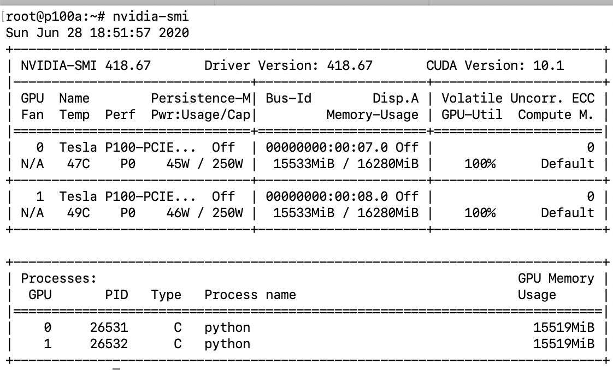
  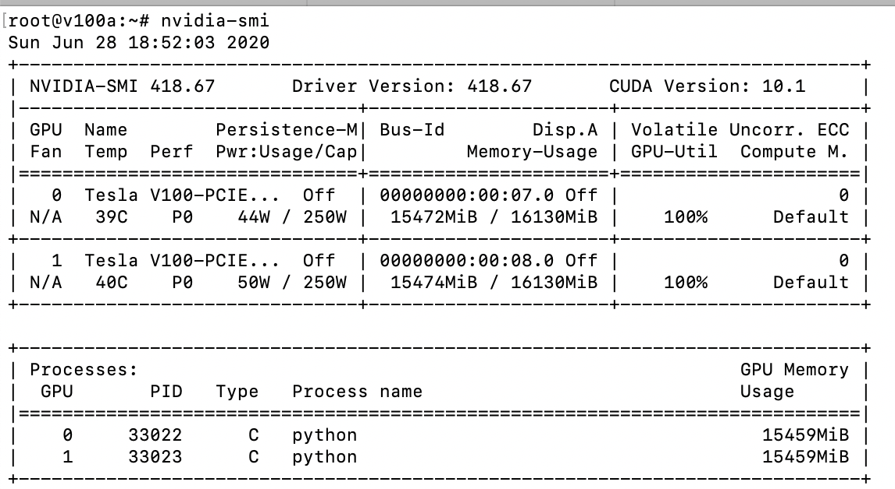

* Did you monitor network traffic (hint: apt install nmon ) ? Was network the bottleneck?
    * Network utilization monitor `nmon` indicated varying degrees of utilizations across v100 and p100. There could be two reasons for these different utilizations 1) v100 being at least 3x faster than p100 2) primary model training happening on v100, hence increased network activity on that machine. Having said that, we don't have reason to believe that network utilization caused much bottleneck in the training.

  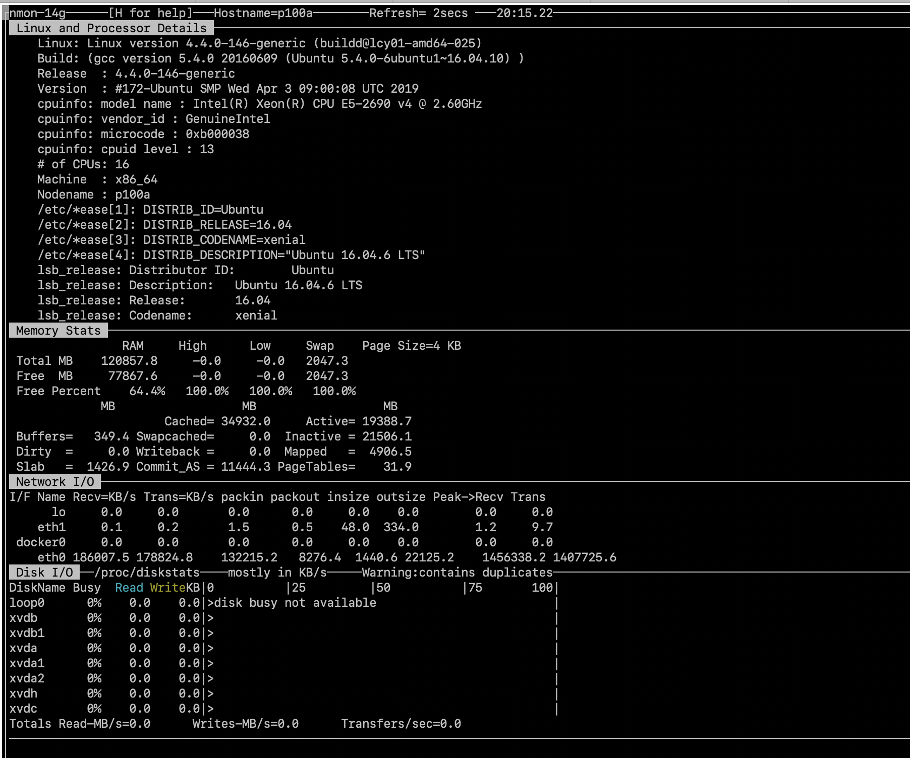
  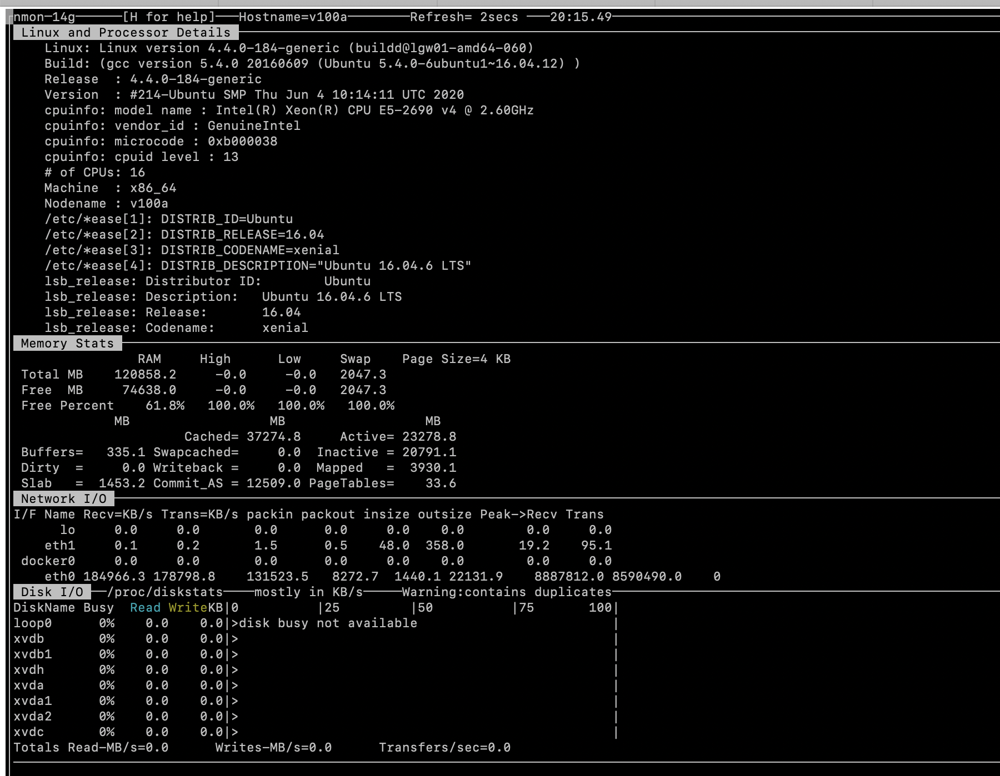

* Take a look at the plot of the learning rate and then check the config file. Can you explan this setting?
    * Reading a little about learning rates and warmup (on forums such as this one <u>https://stackoverflow.com/questions/55933867/what-does-learning-rate-warm-up-mean</u>), and looking at the config file `transformer-base.py ` -- we do see that the learning rate exponentially increases to the first 8,000 steps (as specified in the config file) and then adjusts to optimal rate with training

    * This is happening to avoid overfitting in the model early on in the training. The learning rate is slowly increased up to the first 8k steps while the CNN is being trained.
  

    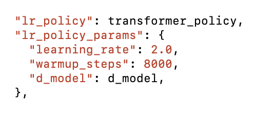
  

* How big was your training set (mb)? How many training lines did it contain?
     * As can be seen from the screenshot of the `/data/wmt16_de_en` folder that contained the model, the primary english corpus was around 678MB and the German corpus was around 607MB (there were some other secondary files that could have marginally increased the size of both english and german datasets by few extra MBs).

     

       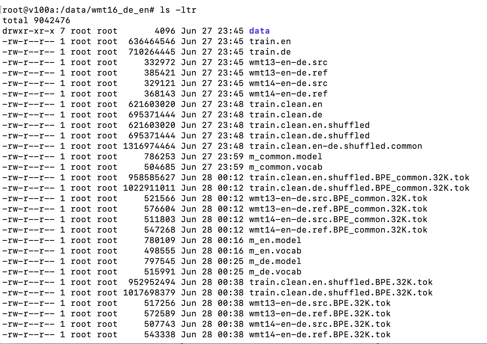
     

* What are the files that a TF checkpoint is comprised of?
   * `model.ckpt-0.index`
   * `model.ckpt-0.data-00000-of-00001`
   * `checkpoint`
   * `model.ckpt-0.meta`
   * `graph.pbtxt` (not sure if this is considered checkpoint?)

* How big is your resulting model checkpoint (mb)?
    * Primary checkpoint file is ~730MB as indicated in the screengrab from `/data/en-de-transformer` folder

    

        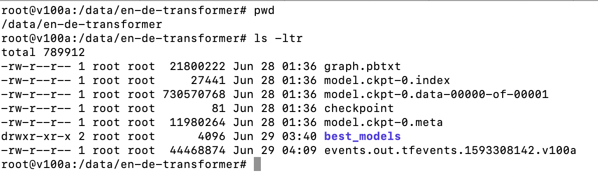
    

* Remember the definition of a "step". How long did an average step take?
    * We ran the model for 53,010 steps. It took the model 1day, 2hours, 3minutes and 19 seconds to complete those 53k steps. That calculates to 93,679 steps. Which comes to 1.80117 seconds per step.

* How does that correlate with the observed network utilization between nodes?
    * Not sure how average step time behaves with network utilization. One could argue that because training happens directly between GPUs and that the workload is allocated by the master node early on the train process, there should be minimal network utilization. However, there can also be a case made that with increased network utilization, time taken can increase (hence adverse correlation).
