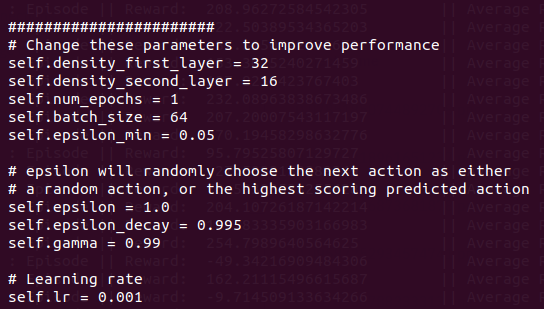
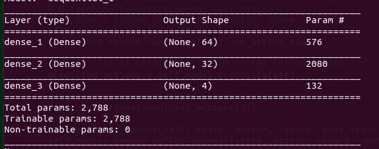
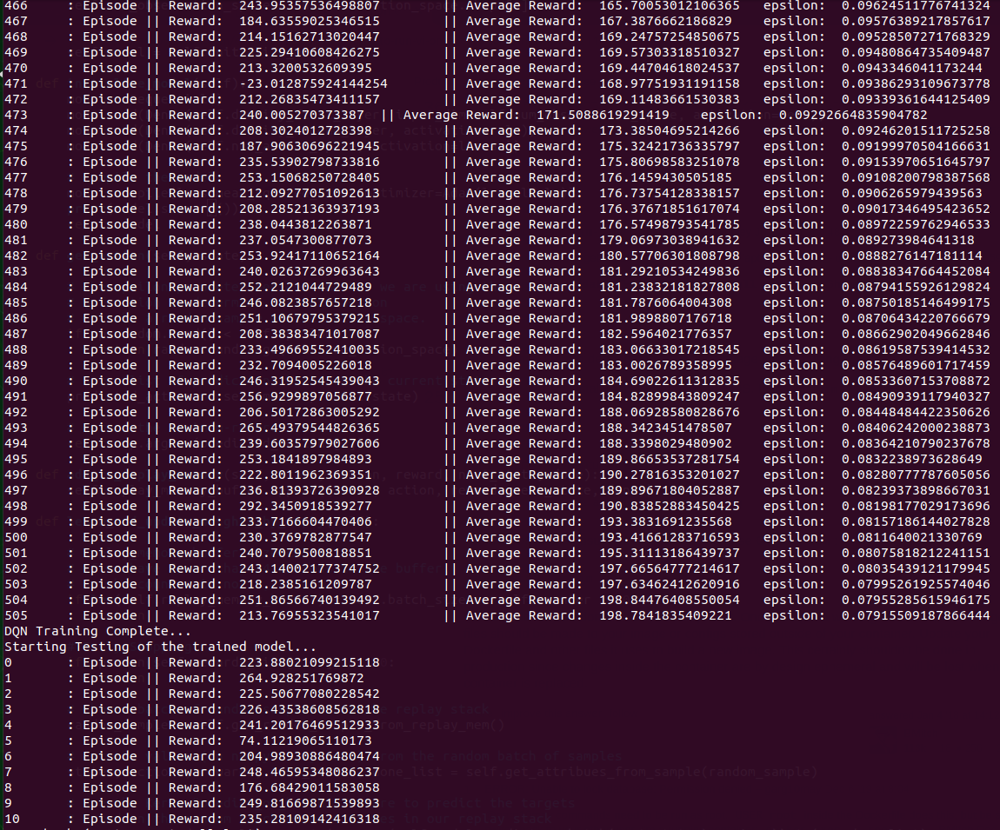
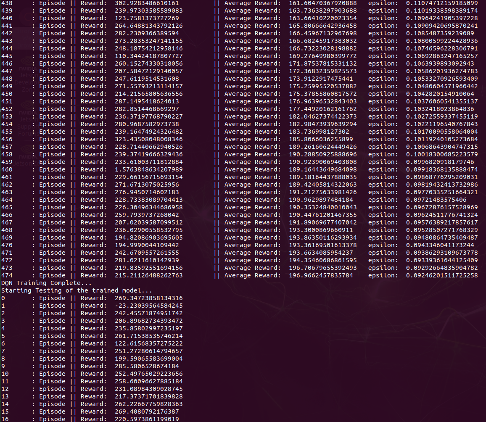

### Homework 11: Robotics and Deep Reinforcement Learning
#### Vaibhav K Beohar - June 2020

<br>

*  What parameters did you change?

  I mostly stuck with changing the density layers of the Neural Network, batch size and epsilon_min parameters to try to make the model converge to an average score of 200 in as little iterations as possible.

* What values did you try?

  Since there was no such "set rule" with the parameters, I felt inclined to test various combinations to converge the model with various rounds of training combinations.

  As such, I changed values in different combinations of parameters across 6 rounds of training (spread across multiple days):

  ```
  | Round | density_first_layer | density_second_layer | epsilon_min | batch_size |
  |-------|---------------------|----------------------|-------------|------------|
  | 1st   | default (32)        | default (16)         | 64          | 0.01       |
  | 2nd   | 144                 | 264                  | 128         | 0.01       |
  | 3rd   | 264                 | 144                  | 128         | 0.001      |
  | 4th   | 200                 | 100                  | 72          | 0.01       |
  | 5th   | 64                  | 32                   | 64          | 0.01       |
  | 6th   | 256                 | 200                  | 128         | 0.001      |
  ```
  <u>Example of a successful training landing</u>  
  

  <u>Example of a default training parameters</u>
  <p float="left">
    
  </p>

  <u>Example of 6th round parameters</u>
  <p float="left">
    
  </p>

* Did you try any other changes that made things better or worse?

  I did not change most of the other params. I initially dabbled with changing `gamma` parameter. But realized that even with very small value changes, the model output was behaving differently (and unpredictably) for different layer sizes. Hence I decided to leave most other params unchanged, partly because of lack of intuition and partly because of large training times.

* Did they improve or degrade the model? Did you have a test run with 100% of the scores above 200?

  As per my observation, increasing the density layers had the most significant difference in performance and convergence time.

  However, it is interesting to note that round 5 of my training (`density_first_layer=64, density_second_layer=32, epsilon_min= 0.01, batch_size=64`) had almost same (if not better) training performance as compared to round 6 (`density_first_layer=256, density_second_layer=200, epsilon_min= 0.001, batch_size=128`).

  As you can tell from below, round 5 converged to a score of 200 in 505 training iterations, whereas round 6 converged to the same result in 474 iterations.

  But what is more interesting is that round 5 "test" scores were almost consistently better than those of round 8 (despite having denser layers).

  <u>Round 5 train & test scores</u>
  ```
  497 	: Episode || Reward:  236.81393726390928 	|| Average Reward:  189.89671804052887 	 epsilon:  0.08239373898667031
  498 	: Episode || Reward:  292.3450918539277 	|| Average Reward:  190.83852883450425 	 epsilon:  0.08198177029173696
  499 	: Episode || Reward:  233.7166604470406 	|| Average Reward:  193.3831691235568 	 epsilon:  0.08157186144027828
  500 	: Episode || Reward:  230.3769782877547 	|| Average Reward:  193.41661283716593 	 epsilon:  0.0811640021330769
  501 	: Episode || Reward:  240.7079500818851 	|| Average Reward:  195.31113186439737 	 epsilon:  0.08075818212241151
  502 	: Episode || Reward:  243.14002177374752 	|| Average Reward:  197.66564777214617 	 epsilon:  0.08035439121179945
  503 	: Episode || Reward:  218.2385161209787 	|| Average Reward:  197.63462412620916 	 epsilon:  0.07995261925574046
  504 	: Episode || Reward:  251.86566740139492 	|| Average Reward:  198.84476408550054 	 epsilon:  0.07955285615946175
  505 	: Episode || Reward:  213.76955323541017 	|| Average Reward:  198.7841835409221 	 epsilon:  0.07915509187866444
  DQN Training Complete...
  Starting Testing of the trained model...
  0 	: Episode || Reward:  223.88021099215118
  1 	: Episode || Reward:  264.928251769872
  2 	: Episode || Reward:  225.50677080228542
  3 	: Episode || Reward:  226.43538608562818
  4 	: Episode || Reward:  241.20176469512933
  5 	: Episode || Reward:  74.11219065110173
  6 	: Episode || Reward:  204.98930886480474
  7 	: Episode || Reward:  248.46595348086237
  8 	: Episode || Reward:  176.68429011583058
  9 	: Episode || Reward:  249.81669871539893
  10 	: Episode || Reward:  235.28109142416318
```  

  <u>Round 6 train & test scores</u>
```
  468 	: Episode || Reward:  236.02900558532795 	|| Average Reward:  193.3000869660911 	 epsilon:  0.09528507271768329
  469 	: Episode || Reward:  194.82086903695605 	|| Average Reward:  193.86350116293934 	 epsilon:  0.09480864735409487
  470 	: Episode || Reward:  194.9990044109442 	|| Average Reward:  193.36169501613378 	 epsilon:  0.0943346041173244
  471 	: Episode || Reward:  242.6709557261555 	|| Average Reward:  193.6634085954237 	 epsilon:  0.09386293109673778
  472 	: Episode || Reward:  281.0211610142939 	|| Average Reward:  194.35460686861595 	 epsilon:  0.09339361644125409
  473 	: Episode || Reward:  219.83592551694156 	|| Average Reward:  196.70679655392493 	 epsilon:  0.09292664835904782
  474 	: Episode || Reward:  215.21126488262763 	|| Average Reward:  196.9662457835784 	 epsilon:  0.09246201511725258
  DQN Training Complete...
  Starting Testing of the trained model...
  0 	: Episode || Reward:  269.34723858134316
  1 	: Episode || Reward:  -23.23039564584245
  2 	: Episode || Reward:  242.45571874951742
  3 	: Episode || Reward:  206.89682734393472
  4 	: Episode || Reward:  235.85802997235197
  5 	: Episode || Reward:  261.71538535746214
  6 	: Episode || Reward:  122.61568357275222
  7 	: Episode || Reward:  251.27280614794657
  8 	: Episode || Reward:  199.59065583699004
  9 	: Episode || Reward:  285.5806528674184
  10 	: Episode || Reward:  252.49765029223656
  11 	: Episode || Reward:  258.60096627885184
  12 	: Episode || Reward:  231.08984309028745
  13 	: Episode || Reward:  217.37371701839828
  14 	: Episode || Reward:  262.22667759828363
  15 	: Episode || Reward:  269.4080792176387
  16 	: Episode || Reward:  220.5973861199019
```


* Based on what you observed, what conclusions can you draw about the different parameters and their values?

  Increasing the variables in the first two layers increases the density of the neural network. The batch size also enhances the model performance by allowing more data to be processed in each iteration, leading to performance improvements.

  Here are some snapshots of the training parameters from various runs.

* What is the purpose of the epsilon value?

  Epsilon value indicates the method to balance exploration and exploitation by choosing between exploration and exploitation randomly.

  The epsilon values indicates to the algorithm the probability of choosing to explore (the algorithm exploits most of the time with a small chance of exploring).

  Over time the as the training progresses, we see that the epsilon goes down, indicating that the algorithm gets more confident in exploiting rather than exploring (a.k.a epsilon decay):


* Describe "Q-Learning".

  Q-learning is an off policy reinforcement learning algorithm that seeks to find the best action to take given the current state.

  It’s considered off-policy because the q-learning function learns from actions that are outside the current policy, like taking random actions, and therefore a policy isn’t needed. More specifically, q-learning seeks to learn a policy that maximizes the total reward.

  The ‘q’ in q-learning stands for quality. Quality in this case represents how useful a given action is in gaining some future reward.

  (courtsey: https://towardsdatascience.com/simple-reinforcement-learning-q-learning-fcddc4b6fe56#:~:text=Q%2Dlearning%20is%20an%20off,a%20policy%20isn't%20needed.)


Videos
------
  https://vebsbuck.s3.us-east.cloud-object-storage.appdomain.cloud/episode0_1st_round.mp4

  https://vebsbuck.s3.us-east.cloud-object-storage.appdomain.cloud/episode100_1st_round.mp4

  https://vebsbuck.s3.us-east.cloud-object-storage.appdomain.cloud/episode500_1st_round.mp4

  https://vebsbuck.s3.us-east.cloud-object-storage.appdomain.cloud/episode1000_1st_round.mp4

  https://vebsbuck.s3.us-east.cloud-object-storage.appdomain.cloud/episode1500_1st_round.mp4

  https://vebsbuck.s3.us-east.cloud-object-storage.appdomain.cloud/episode1580_1st_round.mp4


Stacktrace of results
-----------------------

<u>5th round training</u>
<p float="left">
  
</p>

<u>6th round training</u>
<p float="left">
  
</p>
