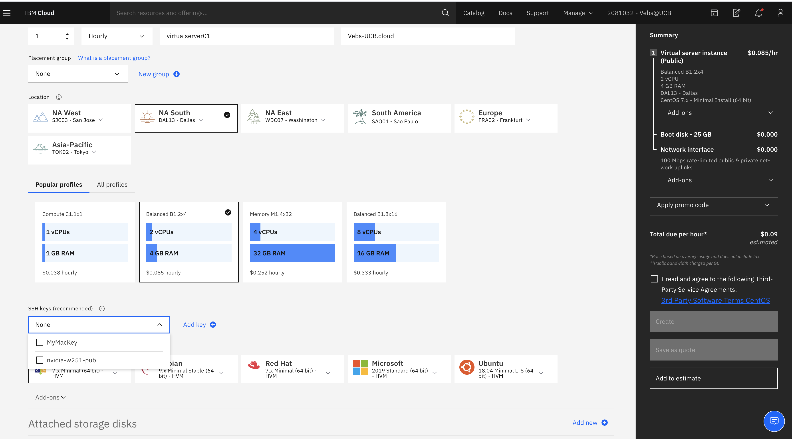

HW12 - Installing GPFS FPO and LazyNLP crawler
------------------------------------------------
### Vaibhav Beohar (w251 / Summer 2020 / UC Berkeley MIDS)


##### Assignment Objective:
[https://github.com/MIDS-scaling-up/v2/tree/master/week12/hw](https://github.com/MIDS-scaling-up/v2/tree/master/week12/hw)

Unfortunately, I was unable to complete this assignment because of some issues with my IBM virtual machines. Following are the steps I took to create three clusters on IBM cloud and trying to install GPFS

##### Create three machines using either IBM GUI or CLI:
```
  -  ibmcloud sl vs create -H gpfs1 -D hw12-veb1.com -c 2 -m 4096 -d dal10 -o CENTOS_7_64 --disk 25 --disk 100 --key=1834866
  -  ibmcloud sl vs create -H gpfs2 -D hw12-veb2.com -c 2 -m 4096 -d dal10 -o CENTOS_7_64 --disk 25 --disk 100 --key=1834866
  -  ibmcloud sl vs create -H gpfs3 -D hw12-veb3.com -c 2 -m 4096 -d dal10 -o CENTOS_7_64 --disk 25 --disk 100 --key=1834866
```

<u>Setting up virtual machines through IBM cloud GUI</u>
<p float="left">
  
</p>

##### Copy private key to each of the virtual machines so they are unable to communicate with each other via SSH and then continue setting up virtual machines

```
  pbcopy < ~/.ssh/id_rsa
  echo 'export PATH=$PATH:/usr/lpp/mmfs/bin' >> /root/.bash_profile

  # export the mmfs path to env
  echo 'export PATH=$PATH:/usr/lpp/mmfs/bin' >> /root/.bash_profile

  # safe key
  chmod 600 /root/.ssh/id_rsa

  # update /etc/hosts with private host names
  echo '10.221.170.76 gpfs1' >> /etc/hosts
  echo '10.221.170.66 gpfs2' >> /etc/hosts
  echo '10.221.170.71 gpfs3' >> /etc/hosts  

  # set up nodenames
  echo 'gpfs1:quorum:' >> /etc/nodefile
  echo 'gpfs2::' >> /etc/nodefile
  echo 'gpfs3::' >> /etc/nodefile

  # add the following to /root/nodefile
  gpfs-hw12-1:quorum:
  gpfs-hw12-2::
  gpfs-hw12-3::  

  # configure fpfs fpo
  yum install -y kernel-devel g++ gcc cpp kernel-headers gcc-c++
  yum update -y

  # make it so hosts will persist
  vi /etc/cloud/cloud.cfg

  # then reboot
  reboot

  #install more pre-reqs
  yum install -y ksh perl libaio m4 net-tools

```

##### Continue installing S3 API client and GPFS
```
  curl "https://s3.amazonaws.com/aws-cli/awscli-bundle.zip" -o "awscli-bundle.zip"
  yum install unzip
  unzip awscli-bundle.zip
  sudo ./awscli-bundle/install -i /usr/local/aws -b /usr/local/bin/aws
  aws configure
  #Access Key ID: A1XGdUexhlIdyusn16Jh
  #Secret Access Key: vImKKsEPfYQuzovEuPZjabeAViRhdQ9P85RQJEt1
  #Geographic location server: [NONE]
  aws --endpoint-url=https://s3-api.us-geo.objectstorage.softlayer.net  s3 cp s3:  homework12/Spectrum_Scale_Standard-5.0.5.0-x86_64-Linux-install Spectrum_Scale_Standard-5.0.5.0-x86_64-Linux-install

```


```
  chmod +x Spectrum_Scale_Standard-5.0.5.0-x86_64-Linux-install
  ./Spectrum_Scale_Standard-5.0.5.0-x86_64-Linux-install --silent

  # The following two blocks ONLY RUN ON THE PRIMARY HOST
  /usr/lpp/mmfs/5.0.5.0/installer/spectrumscale node add gpfs1
  /usr/lpp/mmfs/5.0.5.0/installer/spectrumscale node add gpfs2
  /usr/lpp/mmfs/5.0.5.0/installer/spectrumscale node add gpfs3
```
```
  # block 2 for creating the cluster
  /usr/lpp/mmfs/5.0.5.0/installer/spectrumscale setup -s 10.221.170.76
  /usr/lpp/mmfs/5.0.5.0/installer/spectrumscale callhome disable
```

##### Make sure that the known hosts are updated, check config before you begin and then run install command
```
  ssh gpfs2 ls
  ssh gpfs3 ls

  # check the config before you begie
  #/usr/lpp/mmfs/5.0.5.0/installer/spectrumscale config gpfs -c gpfs
  /usr/lpp/mmfs/5.0.5.0/installer/spectrumscale install
```

<u>At which point you see the following logs:</u>
<p float="left">
  
</p>


##### [ FATAL ] bash: /usr/lpp/mmfs/bin/mmlslicense: No such file or directory
Above error couldn't be resolved.


###### Additional scripts to run in subsequent days (credit to colleague Wade Holmes for putting the script together) as a second attempt to install and run LazyNLP:
==========================================================================================

```
  #!/bin/sh
  # finish up configs
  yum install -y ksh perl libaio m4 net-tools
  # configure aws client file
  mkdir ~/.aws
  echo '[default]' > ~/.aws/credentials
  echo 'aws_access_key=A1XGdUexhlIdyusn16Jh' >> ~/.aws/credentials
  echo 'aws_secret_access_key=vImKKsEPfYQuzovEuPZjabeAViRhdQ9P85RQJEt1' >> ~/.aws/credentials
  # s3 api client
  curl "https://s3.amazonaws.com/aws-cli/awscli-bundle.zip" -o "awscli-bundle.zip"
  yum install unzip
  unzip awscli-bundle.zip
  sudo ./awscli-bundle/install -i /usr/local/aws -b /usr/local/bin/aws
  aws configure
  aws --endpoint-url=https://s3-api.us-geo.objectstorage.softlayer.net  s3 cp s3://homework12/Spectrum_Scale_Standard-5.0.5.0-x86_64-Linux-install Spectrum_Scale_Standard-5.0.5.0-x86_64-Linux-install
  chmod +x Spectrum_Scale_Standard-5.0.5.0-x86_64-Linux-install
  ./Spectrum_Scale_Standard-5.0.5.0-x86_64-Linux-install --silent
  # The following two blocks ONLY RUN ON THE PRIMARY HOST
  /usr/lpp/mmfs/5.0.5.0/installer/spectrumscale node add gpfs1
  /usr/lpp/mmfs/5.0.5.0/installer/spectrumscale node add gpfs2
  /usr/lpp/mmfs/5.0.5.0/installer/spectrumscale node add gpfs3
  # give the cluster a name
  #/usr/lpp/mmfs/5.0.5.0/installer/spectrumscale config gpfs -c gpfs
  # block 2 for creating the cluster
  /usr/lpp/mmfs/5.0.5.0/installer/spectrumscale setup -s 10.22.20.71
  /usr/lpp/mmfs/5.0.5.0/installer/spectrumscale callhome disable
  # make sure that the known hosts are updated
  ssh gpfs2 ls
  ssh gpfs3 ls
  # check the config before you begie
  #/usr/lpp/mmfs/5.0.5.0/installer/spectrumscale config gpfs -c gpfs
  /usr/lpp/mmfs/5.0.5.0/installer/spectrumscale install
  # verify that the cluster is working and all the jazz
  /usr/lpp/mmfs/bin/mmlscluster
  # so there is a story here... and it's not a good one
  #/usr/lpp/mmfs/bin/mmaddnode -N hw12gpfs2.n-a.cloud
  #/usr/lpp/mmfs/bin/mmaddnode -N hw12gpfs3.n-a.cloud
  # if you want to shut them down
  /usr/lpp/mmfs/bin/mmshutdown
  # final steps
  /usr/lpp/mmfs/bin/mmchlicense server -N all
  /usr/lpp/mmfs/bin/mmstartup -a
  /usr/lpp/mmfs/bin/mmgetstate -a
  /usr/lpp/mmfs/bin/mmlscluster
  # disk validation
  fdisk -l |grep Disk |grep bytes
  vi /root/diskfile.fpo
  %pool:
  pool=system
  allowWriteAffinity=yes
  writeAffinityDepth=1
  %nsd:
  device=/dev/xvdc
  servers=gpfs1
  usage=dataAndMetadata
  pool=system
  failureGroup=1
  %nsd:
  device=/dev/xvdc
  servers=gpfs3
  usage=dataAndMetadata
  pool=system
  failureGroup=2
  %nsd:
  device=/dev/xvdc
  servers=gpfs3
  usage=dataAndMetadata
  pool=system
  failureGroup=3
  # check disk status
  mmcrnsd -F /root/diskfile.fpommcrfs gpfsfpo -F /root/diskfile.fpo -A yes -Q no -r 1 -R 1
  mmlsnsd -m
  # replicate
  mmcrfs gpfsfpo -F /root/diskfile.fpo -A yes -Q no -r 1 -R 1
  mmlsfs all
  mmmount all -a


(change servers=gpfs3 to servers=gpfs2 in failureGroup=2)
```
