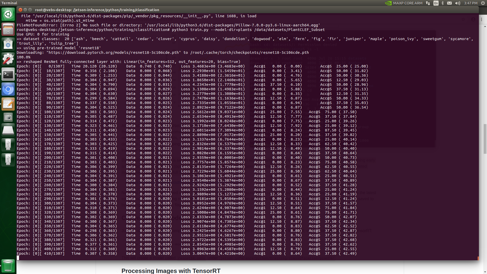

HW13 - Deep Learning SDK (the unofficial one, by Dustin Franklin)
----------------------------------------------------------------
### Vaibhav Beohar (w251 / Summer 2020 / UC Berkeley MIDS)

##### Assignment Objective:
[https://github.com/MIDS-scaling-up/v2/tree/master/week13/hw](https://github.com/MIDS-scaling-up/v2/tree/master/week13/hw)

Using NVIDIA TensorRT for efficiently deploying neural networks onto the embedded Jetson platform, improving performance and power efficiency using graph optimizations, kernel fusion, and FP16/INT8 precision. More info here: https://github.com/dusty-nv/jetson-inference


##### Please submit the time it took you to train the model along with the final accuracy top1/top5 that you were able to achieve. Could you increase the batch size? Why? How long did the training take you? Please save your trained model, we'll use it for the lab.


Following is a snapshot of the training done with default batch_size of 8 and for a default 35 epoch run setting.

<p float="left">
  
</p>

On an average, I received default run time of approximately 12-15 minutes per epoch.


After running for a few epochs, I manually interrupted the session, realizing that it might take too long to train the model with the default settings.

Subsequently, I ran the model for 100 epochs and a batch_size of 16 using the following command:

```
$ python train.py --epoch=100 --batch-size=16 --model-dir=plants ~/datasets/PlantCLEF_Subset
```

I received much better response from the system. With each epoch taking approximately 5.5 minutes. The training for close to a 100 epochs lasted about 8.5 hours. Unfortunately, the model stopped short of training for a full 100 epochs, as my TX2 ran out of memory (think because of insufficient space on the mounted swap disk).

In any case, I was able to train the model for up to 96 epochs (pretty close to the target 100 epochs!).

<p float="left">
  
</p>


### `Best scores (95th epoch): Acc1@58.150, Acc5@87.313`

<u>95th Successful Epoch run</u>
<p float="left">
  
</p>


##### Special notes:
* The dockerfile run command as mentioned on the instructions, yielded the following stacktrace of error in the `make` commands:
```Scanning dependencies of target gl-display-test
[ 63%] Building CXX object utils/display/gl-display-test/CMakeFiles/gl-display-test.dir/gl-display-test.cpp.o
[ 64%] Linking CXX executable ../../../aarch64/bin/gl-display-test
/usr/bin/ld: CMakeFiles/gl-display-test.dir/gl-display-test.cpp.o: undefined reference to symbol 'glColorPointer'
//usr/lib/aarch64-linux-gnu/libGL.so.1: error adding symbols: DSO missing from command line
collect2: error: ld returned 1 exit status
utils/display/gl-display-test/CMakeFiles/gl-display-test.dir/build.make:109: recipe for target 'aarch64/bin/gl-display-test' failed
make[2]: *** [aarch64/bin/gl-display-test] Error 1
CMakeFiles/Makefile2:878: recipe for target 'utils/display/gl-display-test/CMakeFiles/gl-display-test.dir/all' failed
make[1]: *** [utils/display/gl-display-test/CMakeFiles/gl-display-test.dir/all] Error 2
make[1]: *** Waiting for unfinished jobs....
Scanning dependencies of target jetson-inference
[ 65%] Building CXX object CMakeFiles/jetson-inference.dir/c/detectNet.cpp.o
[ 66%] Building CXX object CMakeFiles/jetson-inference.dir/c/segNet.cpp.o
[ 67%] Building CXX object CMakeFiles/jetson-inference.dir/c/tensorNet.cpp.o
[ 68%] Building CXX object CMakeFiles/jetson-inference.dir/calibration/randInt8Calibrator.cpp.o
[ 69%] Building CXX object CMakeFiles/jetson-inference.dir/c/imageNet.cpp.o
[ 70%] Building CXX object CMakeFiles/jetson-inference.dir/plugins/FlattenConcat.cpp.o
[ 71%] Linking CXX shared library aarch64/lib/libjetson-inference.so
[ 71%] Built target jetson-inference
Makefile:129: recipe for target 'all' failed
make: *** [all] Error 2
The command '/bin/sh -c make -j6' returned a non-zero code: 21
```

This was solved by adding a `-i` to the `make` commands (to ignore the failure to the 'RUN make -j6' line and to 'RUN make install' line.  Since we didn't need gl-display-test compiled for the homework)

* While inside the docker container, we received an import error: `ImportError: cannot import name 'PILLOW_VERSION' error`. This was solved by downgrading pillow to 6.1.0 as `pip3 install Pillow==6.1.0`
